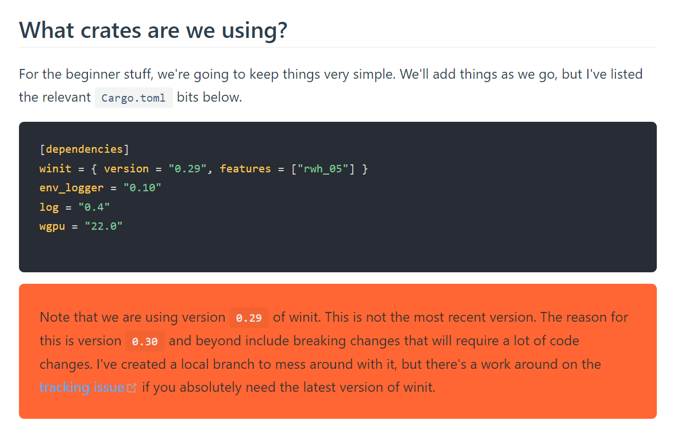
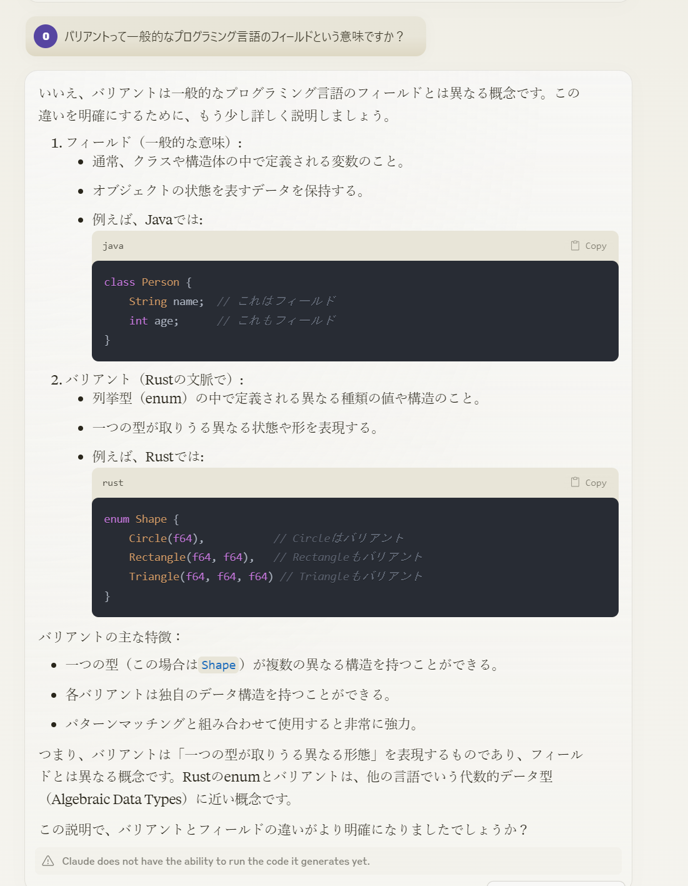
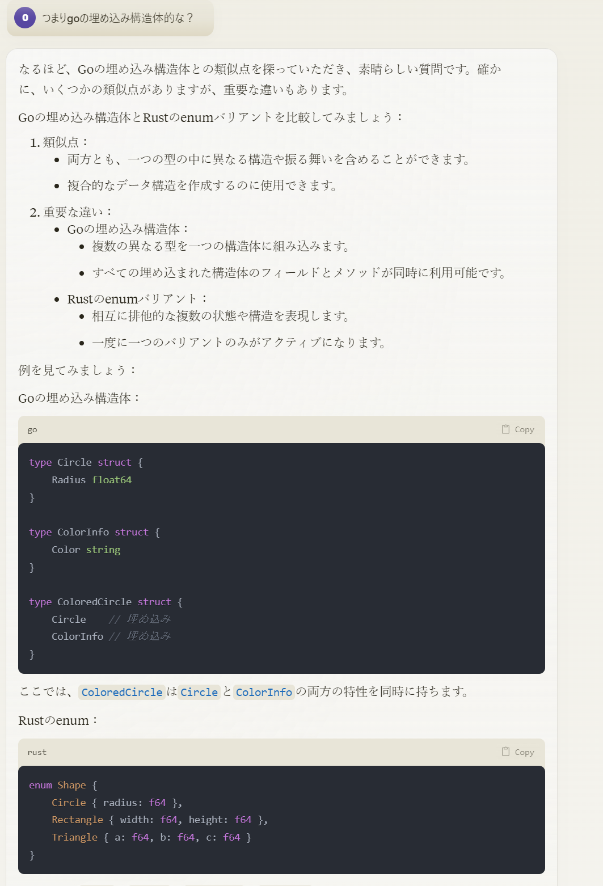
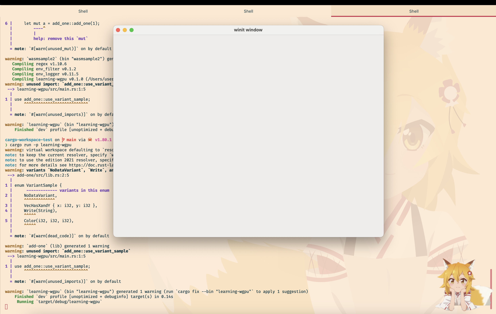

# cargo workspace の playground と learn-wgpu の試し打ち

https://claude.ai/chat/eb7d10b5-ed2d-42e4-a612-a78370fa004e

わかりました。Rust の Cargo ワークスペースを使って **learning-wgpu** と wasmsample2 という 2 つのプロジェクトを作成する手順を説明します。以下の手順に従ってプロジェクトを設定しましょう。

1. まず、新しいディレクトリを作成し、そこに移動します:

```bash
mkdir rust-wgpu-workspace
cd rust-wgpu-workspace
```

2. このディレクトリに `Cargo.toml` ファイルを作成し、ワークスペースを定義します:

```bash
touch Cargo.toml
```

3. `Cargo.toml` ファイルを編集し、以下の内容を追加します:

```toml
[workspace]
members = [
    "learning-wgpu",
    "wasmsample2"
]
```

4. 次に、各プロジェクトのディレクトリを作成します:

```bash
cargo new learning-wgpu
cargo new wasmsample2
```

5. 各プロジェクトの `Cargo.toml` ファイルを編集して、必要な依存関係を追加します。例えば、`learning-wgpu/Cargo.toml` に wgpu の依存関係を追加する場合:

```toml
[dependencies]
wgpu = "0.18"
```

6. 同様に、`wasmsample2/Cargo.toml` に必要な依存関係を追加します。

これで、基本的なワークスペースの構造が整いました。各プロジェクトのソースコードは、それぞれのディレクトリの `src` フォルダ内に配置されます。

プロジェクト全体をビルドする場合は、ルートディレクトリで以下のコマンドを実行します:

```bash
cargo build
```

特定のプロジェクトのみをビルドする場合は、以下のようにします:

```bash
cargo build -p learning-wgpu
```

または

```bash
cargo build -p wasmsample2
```

これで、Cargo ワークスペースを使用して **learning-wgpu** と wasmsample2 プロジェクトを作成できました。各プロジェクトの実装を進めることができます。

追加の情報や特定の実装に関する質問がありましたら、お知らせください。

https://doc.rust-jp.rs/book-ja/ch14-03-cargo-workspaces.html
TRPL が一番わかりやすい

mkdir して手動で Cargo.toml を作ってディレクトリ入ってその下で cargo new add-one --lib して使う側のほうの Cargo.toml を手動で dependencies を書いて import する

その後 extern crate で持ってきて呼び出す

## wgpu の勉強

https://qiita.com/ciscorn/items/c8c18fbcb60475cb4491

https://sotrh.github.io/learn-wgpu/
の写経

### wgpu について

https://crates.io/crates/wgpu
v22 系

#### winit について

https://github.com/rust-windowing/winit
https://docs.rs/winit/latest/winit/

windows のハンドラーのライブラリらしい。

winit は windows 上の window だけじゃなくて chrome 上の canvas とかモバイル OS も統一的に扱える

```
user: root …/work/private/test/cargo-workspace-test/learning-wgpu on  main [!?] is 📦 v0.1.0 via 🦀 v1.80.0
❯ cargo add winit --features rwh_05
warning: virtual workspace defaulting to `resolver = "1"` despite one or more workspace members being on edition 2021 which implies `resolver = "2"`
note: to keep the current resolver, specify `workspace.resolver = "1"` in the workspace root's manifest
note: to use the edition 2021 resolver, specify `workspace.resolver = "2"` in the workspace root's manifest
note: for more details see https://doc.rust-lang.org/cargo/reference/resolver.html#resolver-versions
    Updating crates.io index
      Adding winit v0.30.4 to dependencies
             Features:
             + ahash
             + bytemuck
             + memmap2
             + percent-encoding
             + rwh_05
             + rwh_06
             + sctk
             + sctk-adwaita
             + wayland
             + wayland-backend
             + wayland-client
             + wayland-csd-adwaita
             + wayland-dlopen
             + wayland-protocols
             + wayland-protocols-plasma
             + x11
             + x11-dl
             + x11rb
             - android-game-activity
             - android-native-activity
             - mint
             - rwh_04
             - serde
             - wayland-csd-adwaita-crossfont
             - wayland-csd-adwaita-notitle
warning: virtual workspace defaulting to `resolver = "1"` despite one or more workspace members being on edition 2021 which implies `resolver = "2"`
note: to keep the current resolver, specify `workspace.resolver = "1"` in the workspace root's manifest
note: to use the edition 2021 resolver, specify `workspace.resolver = "2"` in the workspace root's manifest
note: for more details see https://doc.rust-lang.org/cargo/reference/resolver.html#resolver-versions
    Updating crates.io index
     Locking 123 packages to latest compatible versions
      Adding ab_glyph v0.2.28
      Adding ab_glyph_rasterizer v0.1.8
      Adding android-activity v0.6.0
      Adding android-properties v0.2.2
      Adding arrayref v0.3.8
      Adding as-raw-xcb-connection v1.0.1
      Adding atomic-waker v1.1.2
      Adding block2 v0.5.1
      Adding bytemuck v1.16.3
      Adding bytes v1.7.1
      Adding calloop v0.13.0 (latest: v0.14.0)
      Adding calloop-wayland-source v0.3.0
      Adding cc v1.1.7
      Adding cesu8 v1.1.0
      Adding cfg_aliases v0.2.1
      Adding combine v4.6.7
      Adding concurrent-queue v2.5.0
      Adding core-graphics v0.23.2
      Adding crossbeam-utils v0.8.20
      Adding cursor-icon v1.1.0
      Adding dispatch v0.2.0
      Adding dlib v0.5.2
      Adding downcast-rs v1.2.1
      Adding dpi v0.1.1
      Adding errno v0.3.9
      Adding gethostname v0.4.3 (latest: v0.5.0)
      Adding getrandom v0.2.15
      Adding hermit-abi v0.4.0
      Adding jni v0.21.1
      Adding jobserver v0.1.32
      Adding libredox v0.0.2 (latest: v0.1.3)
      Adding linux-raw-sys v0.4.14 (latest: v0.6.4)
      Adding memchr v2.7.4
      Adding memmap2 v0.9.4
      Adding ndk v0.9.0
      Adding ndk-context v0.1.1
      Adding ndk-sys v0.6.0+11769913
      Adding num_enum v0.7.3
      Adding num_enum_derive v0.7.3
      Adding objc-sys v0.3.5
      Adding objc2 v0.5.2
      Adding objc2-app-kit v0.2.2
      Adding objc2-cloud-kit v0.2.2
      Adding objc2-contacts v0.2.2
      Adding objc2-core-data v0.2.2
      Adding objc2-core-image v0.2.2
      Adding objc2-core-location v0.2.2
      Adding objc2-encode v4.0.3
      Adding objc2-foundation v0.2.2
      Adding objc2-link-presentation v0.2.2
      Adding objc2-metal v0.2.2
      Adding objc2-quartz-core v0.2.2
      Adding objc2-symbols v0.2.2
      Adding objc2-ui-kit v0.2.2
      Adding objc2-uniform-type-identifiers v0.2.2
      Adding objc2-user-notifications v0.2.2
      Adding orbclient v0.3.47
      Adding owned_ttf_parser v0.24.0
      Adding percent-encoding v2.3.1
      Adding pin-project v1.1.5
      Adding pin-project-internal v1.1.5
      Adding pin-project-lite v0.2.14
      Adding polling v3.7.2
      Adding proc-macro-crate v3.1.0
      Adding quick-xml v0.34.0 (latest: v0.36.1)
      Adding raw-window-handle v0.5.2 (latest: v0.6.2)
      Adding redox_syscall v0.4.1 (latest: v0.5.3)
      Adding rustix v0.38.34
      Adding same-file v1.0.6
      Adding scoped-tls v1.0.1
      Adding sctk-adwaita v0.10.1
      Adding serde v1.0.204
      Adding serde_derive v1.0.204
      Adding slab v0.4.9
      Adding smithay-client-toolkit v0.19.2
      Adding smol_str v0.2.2
      Adding strict-num v0.1.1 (latest: v0.2.0)
      Adding tiny-skia v0.11.4
      Adding tiny-skia-path v0.11.4
      Adding toml_datetime v0.6.8
      Adding toml_edit v0.21.1 (latest: v0.22.20)
      Adding tracing v0.1.40
      Adding tracing-core v0.1.32
      Adding ttf-parser v0.24.1
      Adding unicode-segmentation v1.11.0
      Adding walkdir v2.5.0
      Adding wasi v0.11.0+wasi-snapshot-preview1 (latest: v0.13.1+wasi-0.2.0)
      Adding wayland-backend v0.3.6
      Adding wayland-client v0.31.5
      Adding wayland-csd-frame v0.3.0
      Adding wayland-cursor v0.31.5
      Adding wayland-protocols v0.32.3
      Adding wayland-protocols-plasma v0.3.3
      Adding wayland-protocols-wlr v0.3.3
      Adding wayland-scanner v0.31.4
      Adding wayland-sys v0.31.4
      Adding web-time v1.1.0
      Adding windows-sys v0.45.0 (latest: v0.59.0)
      Adding windows-sys v0.52.0 (latest: v0.59.0)
      Adding windows-targets v0.42.2 (latest: v0.52.6)
      Adding windows-targets v0.48.5 (latest: v0.52.6)
      Adding windows_aarch64_gnullvm v0.42.2 (latest: v0.52.6)
      Adding windows_aarch64_gnullvm v0.48.5 (latest: v0.52.6)
      Adding windows_aarch64_msvc v0.42.2 (latest: v0.52.6)
      Adding windows_aarch64_msvc v0.48.5 (latest: v0.52.6)
      Adding windows_i686_gnu v0.42.2 (latest: v0.52.6)
      Adding windows_i686_gnu v0.48.5 (latest: v0.52.6)
      Adding windows_i686_msvc v0.42.2 (latest: v0.52.6)
      Adding windows_i686_msvc v0.48.5 (latest: v0.52.6)
      Adding windows_x86_64_gnu v0.42.2 (latest: v0.52.6)
      Adding windows_x86_64_gnu v0.48.5 (latest: v0.52.6)
      Adding windows_x86_64_gnullvm v0.42.2 (latest: v0.52.6)
      Adding windows_x86_64_gnullvm v0.48.5 (latest: v0.52.6)
      Adding windows_x86_64_msvc v0.42.2 (latest: v0.52.6)
      Adding windows_x86_64_msvc v0.48.5 (latest: v0.52.6)
      Adding winit v0.30.4
      Adding winnow v0.5.40 (latest: v0.6.18)
      Adding x11-dl v2.21.0
      Adding x11rb v0.13.1
      Adding x11rb-protocol v0.13.1
      Adding xcursor v0.3.6
      Adding xkbcommon-dl v0.4.2
      Adding xkeysym v0.2.1

```

## 0.29 に固定する



```
1. cargo.tomlを直接いじる
2. cargo build
3. cargo update
```

winit 0.29 が入ったかどうかを見るには

```
cargo tree
```

## その他のライブラリ、env_logger や log について追加

```
cargo add env-logger log
```

## rust の勉強

バリアントとフィールドの違い


理解。バリアントはenumのフィールドだがその実態は埋め込み構造体のようなもの。enumで埋め込み構造体を表現する
```

```

## macなら動いた


## rlibとcdylibについて
https://qiita.com/etoilevi/items/4bd4c5b726e41f5a6689

rlibがrustから利用されるlib
cdylibがffiされるlib
dylibとcdylibがある。dylibはもちろん動的ライブラリ。で静的ライブラリもある。

rlibはrust static library

libを作るときにはlib.rsという名前にする必要がある、もしくはlibセクションの中でpathを指定してあげる必要がある

別ファイルから呼び出すときはmodを忘れないように

## それぞれで使われてるcrate
cfg-if・・・マクロをつき足す。unixのみ動作するとかができるようになる

wasm-bindgen-futuresはwasm-bindgenのpromiseとjsのpromiseをつなぐ
https://crates.io/crates/wasm-bindgen-futures

console_log・・・jsのconsole.log apiに送る

console_error_panic_hook・・・rustのpanicにhookしてpanicの内容をjsのconsole.logに送る