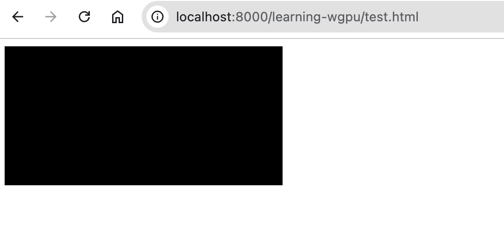

cargo add wgpu をする

```
user: root …/work/private/test/cargo-workspace-test/learning-wgpu on  main [!] is 📦 v0.1.0 via 🦀 v1.80.0
❯ cargo add wgpu
warning: virtual workspace defaulting to `resolver = "1"` despite one or more workspace members being on edition 2021 which implies `resolver = "2"`
note: to keep the current resolver, specify `workspace.resolver = "1"` in the workspace root's manifest
note: to use the edition 2021 resolver, specify `workspace.resolver = "2"` in the workspace root's manifest
note: for more details see https://doc.rust-lang.org/cargo/reference/resolver.html#resolver-versions
    Updating crates.io index
      Adding wgpu v22.1.0 to dependencies
             Features:
             + dx12
             + metal
             + webgpu
             + wgsl
             - angle
             - counters
             - fragile-send-sync-non-atomic-wasm
             - glsl
             - naga-ir
             - replay
             - serde
             - spirv
             - strict_asserts
             - vulkan-portability
             - webgl
             - wgc
warning: virtual workspace defaulting to `resolver = "1"` despite one or more workspace members being on edition 2021 which implies `resolver = "2"`
note: to keep the current resolver, specify `workspace.resolver = "1"` in the workspace root's manifest
note: to use the edition 2021 resolver, specify `workspace.resolver = "2"` in the workspace root's manifest
note: for more details see https://doc.rust-lang.org/cargo/reference/resolver.html#resolver-versions
    Updating crates.io index
     Locking 114 packages to latest compatible versions
      Adding bit-set v0.6.0 (latest: v0.8.0)
      Adding bit-vec v0.7.0 (latest: v0.8.0)
      Adding bitflags v1.3.2 (latest: v2.6.0)
      Adding cfg_aliases v0.1.1 (latest: v0.2.1)
      Adding glow v0.13.1 (latest: v0.14.0)
      Adding gpu-allocator v0.26.0 (latest: v0.27.0)
      Adding jni-sys v0.3.0 (latest: v0.4.0)
      Adding malloc_buf v0.0.6 (latest: v1.0.0)
      Adding ndk-sys v0.5.0+25.2.9519653 (latest: v0.6.0+11769913)
      Adding rustc-hash v1.1.0 (latest: v2.0.0)
      Adding syn v1.0.109 (latest: v2.0.72)
      Adding windows v0.52.0 (latest: v0.58.0)
      Adding windows-core v0.52.0 (latest: v0.58.0)

```

cargo run -p xxx について

```
user: root …/Owner/work/private/test/cargo-workspace-test on  main [!] via 🦀 v1.80.0
❯ cargo run -p learning-wgpu/
warning: virtual workspace defaulting to `resolver = "1"` despite one or more workspace members being on edition 2021 which implies `resolver = "2"`
note: to keep the current resolver, specify `workspace.resolver = "1"` in the workspace root's manifest
note: to use the edition 2021 resolver, specify `workspace.resolver = "2"` in the workspace root's manifest
note: for more details see https://doc.rust-lang.org/cargo/reference/resolver.html#resolver-versions
error: package ID specification `learning-wgpu/` looks like a file path, maybe try file:///mnt/c/Users/Owner/work/private/test/cargo-workspace-test/learning-wgpu

user: root …/Owner/work/private/test/cargo-workspace-test on  main [!] via 🦀 v1.80.0
❯ cargo run -p learning-wgpu
warning: virtual workspace defaulting to `resolver = "1"` despite one or more workspace members being on edition 2021 which implies `resolver = "2"`
note: to keep the current resolver, specify `workspace.resolver = "1"` in the workspace root's manifest
note: to use the edition 2021 resolver, specify `workspace.resolver = "2"` in the workspace root's manifest
note: for more details see https://doc.rust-lang.org/cargo/reference/resolver.html#resolver-versions
    Finished `dev` profile [unoptimized + debuginfo] target(s) in 2.03s
     Running `target/debug/learning-wgpu`
Hello, world!
```

#　作ったwasmを開く
test.htmlを用意してwasm-packでビルドしたwasmを開く。
```
cargo-workspace-test on  main [?] via 🦀 v1.80.1 on ☁️   
❯ python -m http.server
Serving HTTP on :: port 8000 (http://[::]:8000/) ...
::1 - - [10/Aug/2024 09:51:29] "GET / HTTP/1.1" 200 -
::1 - - [10/Aug/2024 09:51:29] code 404, message File not found
::1 - - [10/Aug/2024 09:51:29] "GET /favicon.ico HTTP/1.1" 404 -
::1 - - [10/Aug/2024 09:51:36] "GET /learning-wgpu/ HTTP/1.1" 200 -
::1 - - [10/Aug/2024 09:51:37] "GET /learning-wgpu/test.html HTTP/1.1" 200 -
::1 - - [10/Aug/2024 09:51:37] "GET /learning-wgpu/pkg/learning_wgpu.js HTTP/1.1" 200 -
::1 - - [10/Aug/2024 09:51:37] "GET /learning-wgpu/pkg/learning_wgpu_bg.wasm HTTP/1.1" 200 -
::1 - - [10/Aug/2024 09:51:37] "GET /learning-wgpu/pkg/learning_wgpu.js HTTP/1.1" 200 -

```
こうなった


## chapter2
ビルドはできたけどエラーが出た
```
learning_wgpu.js:346 panicked at learning-wgpu/src/lib.rs:62:89:
called `Option::unwrap()` on a `None` value

Stack:

Error
    at imports.wbg.__wbg_new_abda76e883ba8a5f (http://localhost:8000/learning-wgpu/pkg/learning_wgpu.js:330:21)
    at http://localhost:8000/learning-wgpu/pkg/learning_wgpu_bg.wasm:wasm-function[1126]:0x53156
    at http://localhost:8000/learning-wgpu/pkg/learning_wgpu_bg.wasm:wasm-function[498]:0x347f3
    at http://localhost:8000/learning-wgpu/pkg/learning_wgpu_bg.wasm:wasm-function[816]:0x4a6a5
    at http://localhost:8000/learning-wgpu/pkg/learning_wgpu_bg.wasm:wasm-function[788]:0x48afa
    at http://localhost:8000/learning-wgpu/pkg/learning_wgpu_bg.wasm:wasm-function[1037]:0x518b9
    at http://localhost:8000/learning-wgpu/pkg/learning_wgpu_bg.wasm:wasm-function[317]:0xff74
    at http://localhost:8000/learning-wgpu/pkg/learning_wgpu_bg.wasm:wasm-function[389]:0x29231
    at http://localhost:8000/learning-wgpu/pkg/learning_wgpu_bg.wasm:wasm-function[941]:0x5066d
    at __wbg_adapter_64 (http://localhost:8000/learning-wgpu/pkg/learning_wgpu.js:239:10)


imports.wbg.__wbg_error_f851667af71bcfc6 @ learning_wgpu.js:346
$func1126 @ learning_wgpu_bg.wasm:0x53228
$func498 @ learning_wgpu_bg.wasm:0x347f3
$func816 @ learning_wgpu_bg.wasm:0x4a6a5
$func788 @ learning_wgpu_bg.wasm:0x48afa
$func1037 @ learning_wgpu_bg.wasm:0x518b9
$func317 @ learning_wgpu_bg.wasm:0xff74
$func389 @ learning_wgpu_bg.wasm:0x29231
$_dyn_core__ops__function__FnMut__A____Output___R_as_wasm_bindgen__closure__WasmClosure___describe__invoke__h692562d73c68a61c @ learning_wgpu_bg.wasm:0x5066d
__wbg_adapter_64 @ learning_wgpu.js:239
real @ learning_wgpu.js:200Understand this error
learning_wgpu_bg.wasm:0x34819 Uncaught RuntimeError: unreachable
    at learning_wgpu_bg.wasm:0x34819
    at learning_wgpu_bg.wasm:0x4a6a5
    at learning_wgpu_bg.wasm:0x48afa
    at learning_wgpu_bg.wasm:0x518b9
    at learning_wgpu_bg.wasm:0xff74
    at learning_wgpu_bg.wasm:0x29231
    at learning_wgpu_bg.wasm:0x5066d
    at __wbg_adapter_64 (learning_wgpu.js:239:10)
    at real (learning_wgpu.js:200:20)
```
# エラーが変わった
```
WASM Loaded
learning_wgpu.js:1492 Uncaught Error: Using exceptions for control flow, don't mind me. This isn't actually an error!
    at imports.wbg.__wbindgen_throw (learning_wgpu.js:1492:15)
    at learning_wgpu_bg.wasm:0x52487
    at learning_wgpu_bg.wasm:0xfedd
    at learning_wgpu_bg.wasm:0x2928f
    at learning_wgpu_bg.wasm:0x506cb
    at __wbg_adapter_64 (learning_wgpu.js:239:10)
    at real (learning_wgpu.js:200:20)
imports.wbg.__wbindgen_throw @ learning_wgpu.js:1492
$func1079 @ learning_wgpu_bg.wasm:0x52487
$func317 @ learning_wgpu_bg.wasm:0xfedd
$func389 @ learning_wgpu_bg.wasm:0x2928f
$_dyn_core__ops__function__FnMut__A____Output___R_as_wasm_bindgen__closure__WasmClosure___describe__invoke__h692562d73c68a61c @ learning_wgpu_bg.wasm:0x506cb
__wbg_adapter_64 @ learning_wgpu.js:239
real @ learning_wgpu.js:200Understand this error
test.html:1 Command buffer recording ended before [RenderPassEncoder "render path"] was ended.
    at Finish (../../third_party/dawn/src/dawn/native/EncodingContext.cpp:236)
Understand this warning
18[Invalid CommandBuffer "render encoder" from CommandEncoder "render encoder"] is invalid.
 - While calling [Queue].Submit([[Invalid CommandBuffer "render encoder" from CommandEncoder "render encoder"]])
Understand this warning
test.html:1 [Invalid CommandBuffer "render encoder" from CommandEncoder "render encoder"] is invalid.
 - While calling [Queue].Submit([[Invalid CommandBuffer "render encoder" from CommandEncoder "render encoder"]])

 略

 Texture size ([Extent3D width:9600, height:4800, depthOrArrayLayers:1]) exceeded maximum texture size ([Extent3D width:8192, height:8192, depthOrArrayLayers:256]).
    at ValidateTextureSize (../../third_party/dawn/src/dawn/native/Texture.cpp:305)
Understand this warning
14Could not create the swapchain texture.
    at APIInjectError (..<URL>)
Understand this warning
14[Invalid Texture] is invalid.
 - While calling [Invalid Texture].CreateView([TextureViewDescriptor]).
Understand this warning
14[Invalid TextureView] is invalid.
 - While validating colorAttachments[0].
 - While encoding [CommandEncoder "render encoder"].BeginRenderPass([null]).
Understand this warning
13Parent encoder of [Invalid RenderPassEncoder "render path"] is already finished.
 - While encoding [Invalid RenderPassEncoder "render path"].End().
Understand this warning
test.html:1 Texture size ([Extent3D width:19200, height:9600, depthOrArrayLayers:1]) exceeded maximum texture size ([Extent3D width:8192, height:8192, depthOrArrayLayers:256]).
    at ValidateTextureSize (../../third_party/dawn/src/dawn/native/Texture.cpp:305)
```

# capter3
## WGSLについて
wgpuではWGSLから内部のレンダラー(valkanのspir-vやmetalのHSL、dx12のhlslやopenglのglslなど)への変換はnagaで行われる
* w3cが策定
* rustに似た構文
エントリーポイントには下記の3つがある
@vertex
@fragment
@compute
https://zenn.dev/oyatomo/books/2d-rendering-with-wgpu/viewer/13_wgsl#wgsl-%E3%81%A8%E3%81%AF
chapter3では@vertexと@fragmentを書く必要があった。

# カバレッジ計測　in rust
https://zenn.dev/collabostyle/articles/f0654aa0feaba8
rustのプログラムは遅いことが多いcargo build及びcargo run

cargo install cargo-llvm-covとrustup component add llvm-tools-preview
cargoはrustupに管理されてる一つのツールチェイン
https://claude.ai/chat/f71c3cd4-f359-47c4-8a22-57cfe3d52762

```
cargo llvm-cov --open
```
テストカバレッジを計測できる。

## image crate
include_bytes!(),任意のファイルをbyteに落とし込めるのもすごいんだけどそれの存在確認までちゃんとするのもすごい。ファイルが存在しなかったらコンパイルもしてないのに警告を出してくれる。